# **TechSta`X` Assignment**
---
### Steps to setup the project
1. Expose the flask endpoint in the `webhooks`.


2. Select `Pull-Request` and `Pushes` to setup webhooks.

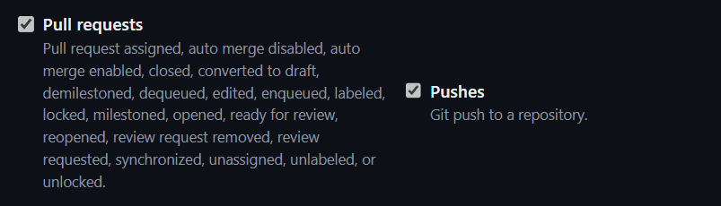

3. Start the flask server.

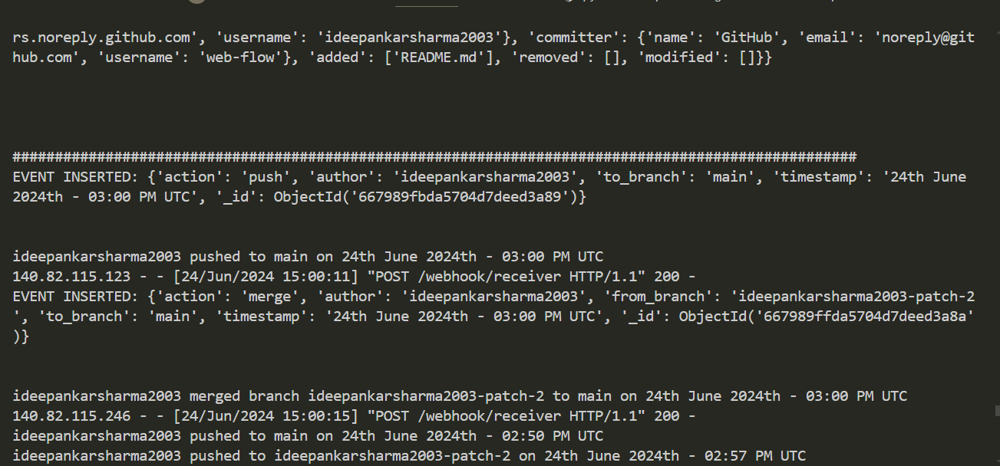

4. In `app/extensions.py` we can comment this line. I only added that because there were so many logs in UI.
```python
mongo = MongoClient('mongodb://localhost:27017/')
db = mongo['webhook_db']
# db.drop_collection("events")
collection = db['events']
```


---
### Screenshots
---
1. `Push`: Removed everything from my repository and made the commit .

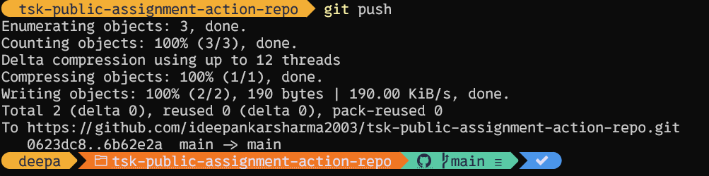

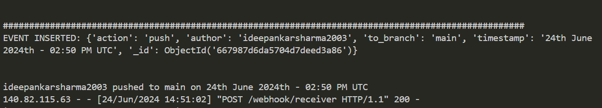

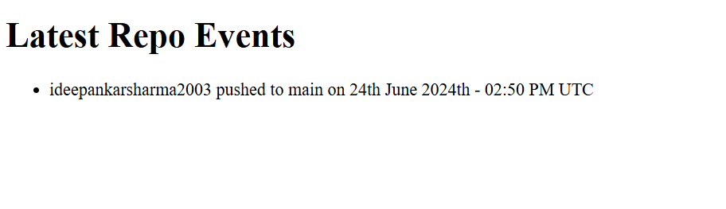

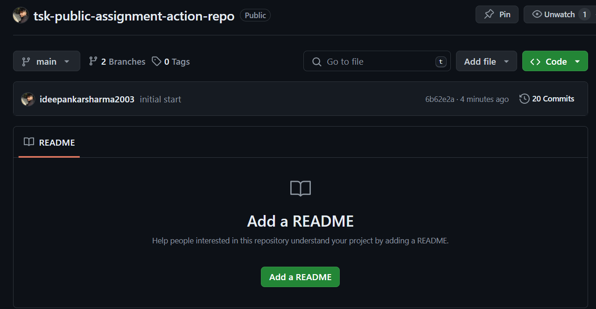
---

2. `Pull Request`: Made a pull request from the branch `ideepankarsharma2003-patch-2`.

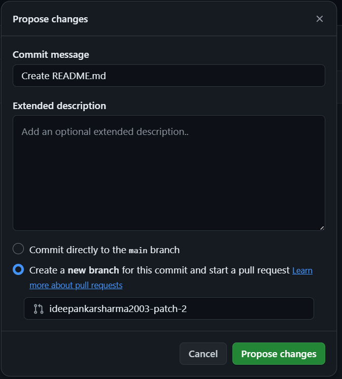

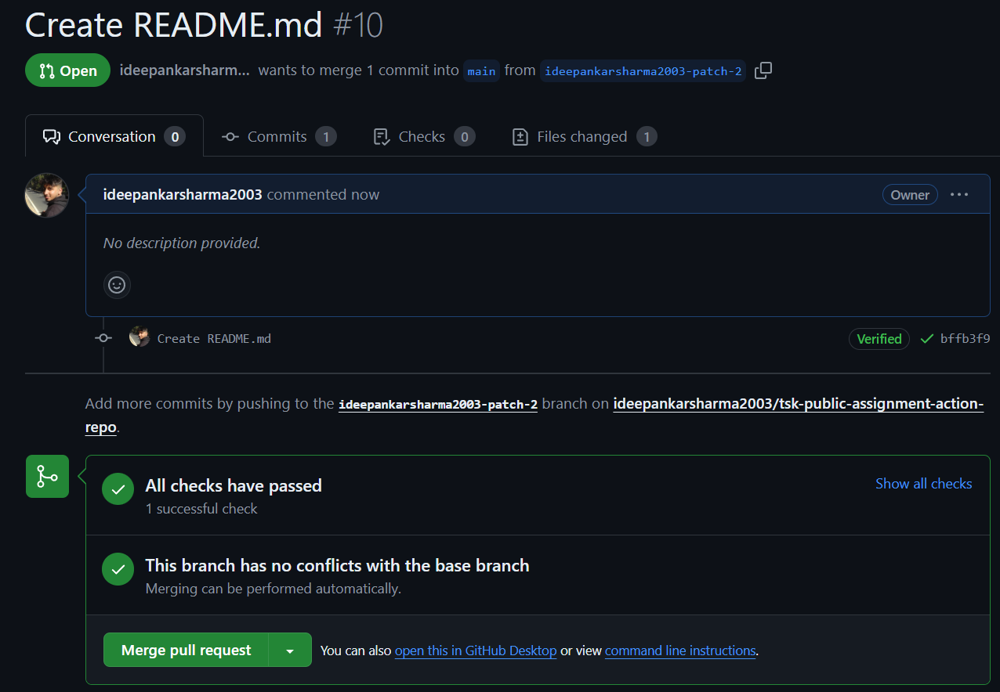

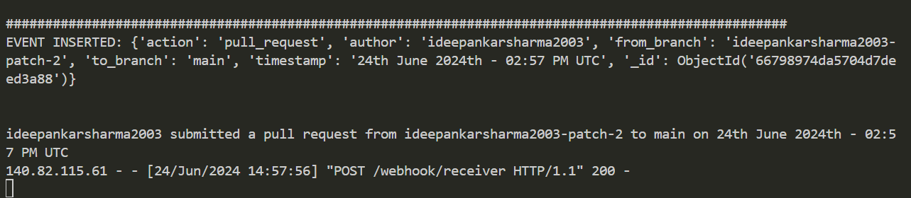

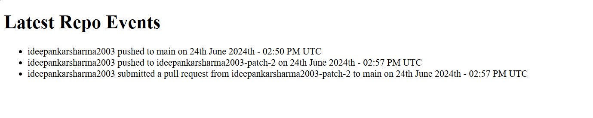
---
3. `Merge`: Merged the branch `ideepankarsharma2003-patch-2` with the `main`.

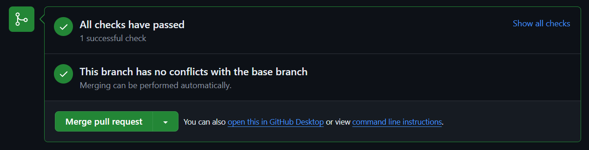

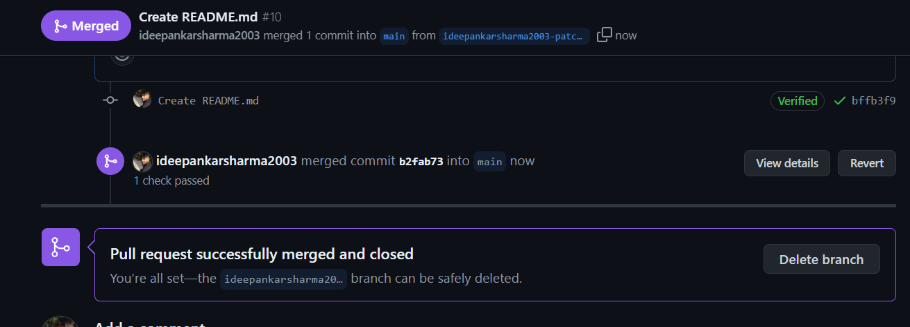

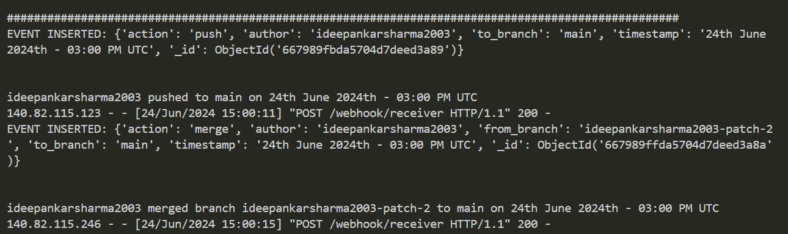

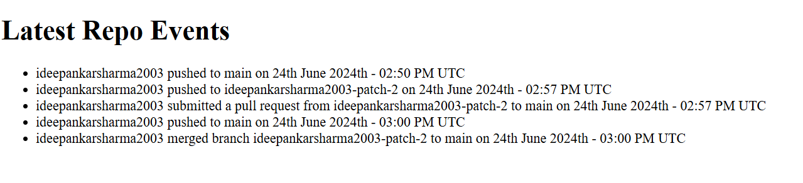